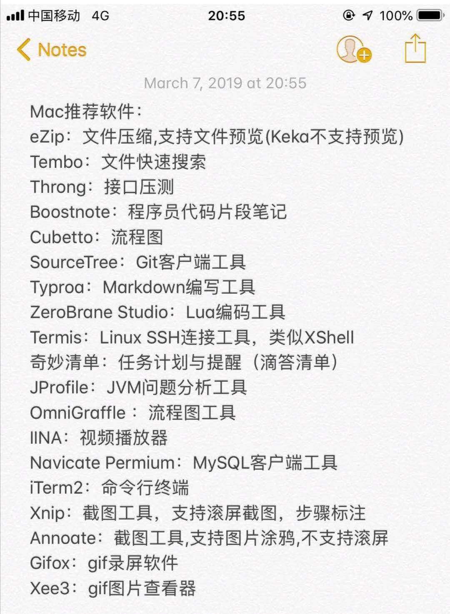

<h1>
    
小书签

</h1>
*只是一个记录，类似收藏夹*

## 收藏

> <https://www.v2ex.com/t/561711>

**谢谢 @[expy](https://www.v2ex.com/member/expy) 提供的学习幼儿园到高中的数学网站：**
中文 - <https://www.shuxuele.com/>
英文 - <https://www.mathsisfun.com/>

----

#### mac 推荐

<https://www.v2ex.com/t/563292#reply125>

<https://github.com/hzlzh/Best-App>

录屏软件 kap 相当好用，能导出成 GIF，MP4。免费，开源。<https://getkap.co/>

------

## 应用

| name                                                     | note                                                         |
| -------------------------------------------------------- | ------------------------------------------------------------ |
| [Caddy](https://caddyserver.com)                         | 可替代Nginx的Https/2的Web服务器  配置简单。插件方便。自动开启 https。 自动更新Let's Encrypt 证书。 |
| [Cloudron](https://cloudron.io/index.html)               | 一个一键安装App平台.Cloudron is a complete solution for running apps on your server and keeping them up-to-date and secure. |
| [typora](https://www.typora.io/)                         | markdown 编辑器  typora 小技巧 `typora-root-url: ../`        |
| [Rocket.Chat](https://github.com/RocketChat/Rocket.Chat) | 跨平台全面的聊天服务器。功能类似 Slack。ReadMe里有可以免费部署的服务示例。 |

## 科学上网

| name                                                     | note                                                    |
| -------------------------------------------------------- | ------------------------------------------------------- |
| [free-ss](https://free-ss.site/)  <https://free-ss.ooo/> | 免费 ss vmess <https://github.com/free-ss/free-ss.site> |
|                                                          |                                                         |

## 接口

| name                        | note                                         |
| --------------------------- | -------------------------------------------- |
| ip  <http://httpbin.org/ip> | {   "origin": "218.2.184.58, 218.2.184.58" } |
| <https://mzr.me/>           | mzr is me  公共DNS  公共NTP  在线二维码API   |
| 磁力链接搜索                | <https://sou.becmd.com/>                     |
| 免费接收短信                | <https://www.becmd.com/>                     |
| 免费接收短信                | <https://www.cnwml.com/>                     |

## 教程

| name  | note                                                |
| ----- | --------------------------------------------------- |
| React | <http://www.ruanyifeng.com/blog/2015/03/react.html> |
| React | <https://segmentfault.com/a/1190000012921279>       |
|       |                                                     |

### 后台管理框架

| type                                                        | addr                                                    |
| ----------------------------------------------------------- | ------------------------------------------------------- |
| vue                                                         | <https://github.com/huangtao/gameld-admin>              |
| vue                                                         | https://github.com/herozhou/vue-framework-wz            |
| vue                                                         | <https://gitee.com/77135016/vueXieDeGuanLiHouTaiMoBan>  |
| vue                                                         | <https://github.com/harsima/vue-backend>  推荐          |
| react antd                                                  | <https://github.com/yezihaohao/react-admin>             |
| React+webpack+redux+ant design+axios+less全家桶后台管理框架 | <https://github.com/duxianwei520/react>                 |
| React-Antd                                                  | <https://github.com/zhangZhiHao1996/react-admin-master> |
| 实时日志分析系统后台数据管理系统 react mobx  ts             | <https://github.com/tinylog/tinylog-ui>                 |

IOS免越狱模拟定位。

<https://github.com/JonneyDong/JocationRelease>

https://github.com/JonneyDong/

短网址

| name | addr          |
| ---- | ------------- |
| kks  | http://kks.me |

图床

速度快免费 直接上传
https://sm.ms/

在线 photoshop
https://www.photopea.com/

阿里公共 DNS 223.5.5.5
电信
114.114.114.114

cname  a记录查询
http://dbcha.com/

tools
http://tool.liumingye.cn/

微信域名屏蔽检测
http://wx.rrbay.com
http://wx.rrbay.com/pro/wxUrlCheck.ashx?url=http://www.baidu.com

微信小程序开发框架
https://wepyjs.github.io/wepy-docs/2.x/#/base/instance

在线转换工具（视频，图片)
https://convertio.co/zh/mp4-mp3/

百度盘搜索工具
http://yun.java1234.com/

工具站
https://www.dute.org/
工具站，有视频聚合
http://www.ojit.com/

拖拽方式生成网页：
https://github.com/givanz/VvvebJs

临时主机
4小时 https://labs.play-with-docker.com
https://labs.play-with-k8s.com
2小时 https://dashboard.daocloud.io/

PaaS部分免费使用
https://leancloud.cn
https://www.it120.cc/

游戏服务端云
https://www.matchvs.com/

云开发
https://www.bmob.cn/

腾讯云实验中心。
https://cloud.tencent.com/developer/labs/gallery?category=experience

下载中转：
https://kkwen.cn/index.php/archives/3/
 http://f.kkwen.cn/kwen/download?url=

android 电影视频app
http://sokuyun.cc/

文件与文件夹对比同步
https://freefilesync.org/

百度盘下载工具
http://pandownload.com/
https://github.com/b3log/baidu-netdisk-downloaderx

ssr 订阅
https://github.com/AmazingDM/sub
https://m.raws.tk/
https://raw.githubusercontent.com/ssrsub/ssr/master/ssrsub
https://www.raws.tk/app/ios/
https://github.com/eycorsican/rule-sets

免费CDN：
 https://inxy.host/products/cdn/

试用30天 速度很快
https://www.keycdn.com/

静态文件 cdn
https://www.staticfile.org/

npm github
https://www.jsdelivr.com

npm:
https://unpkg.com/

